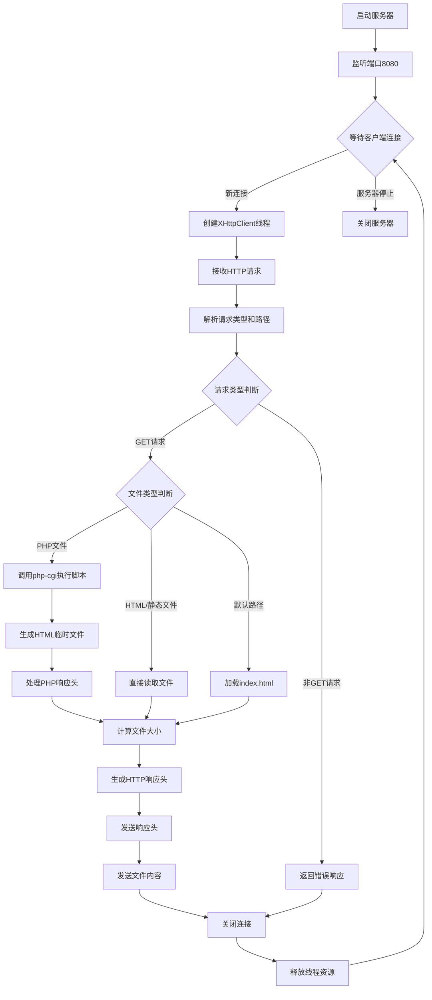
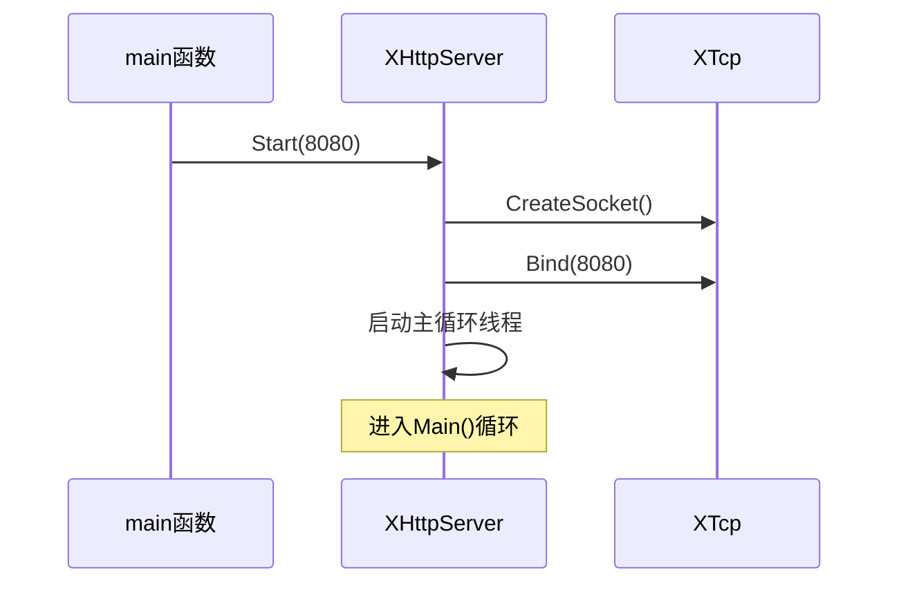
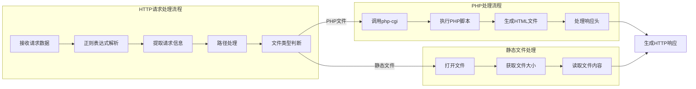
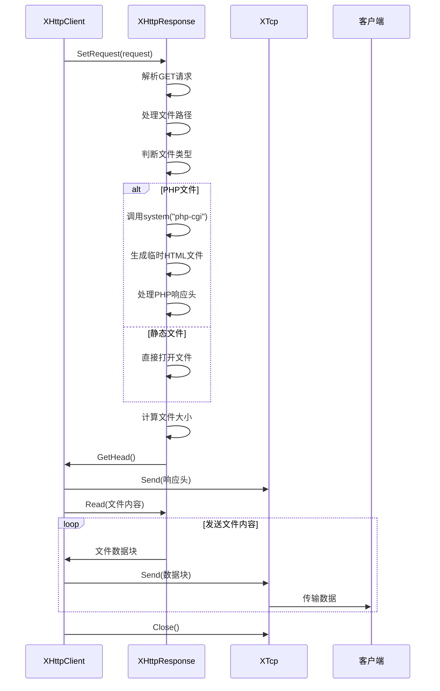
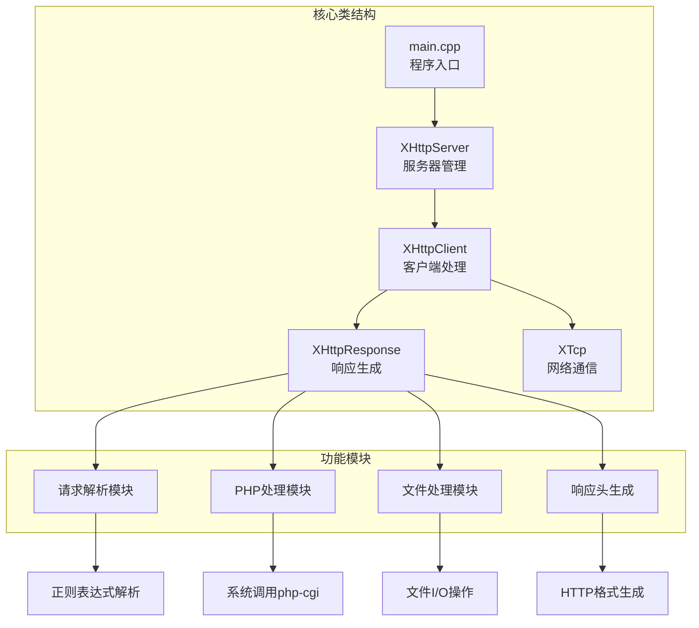
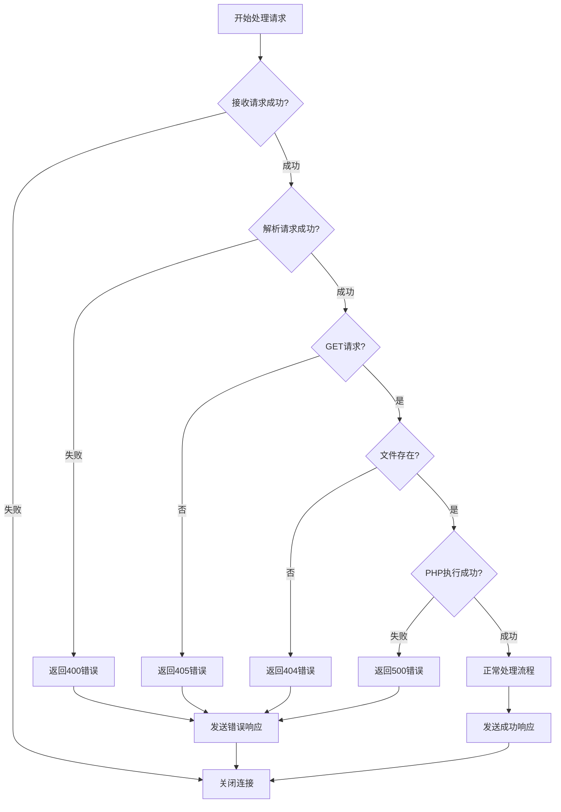
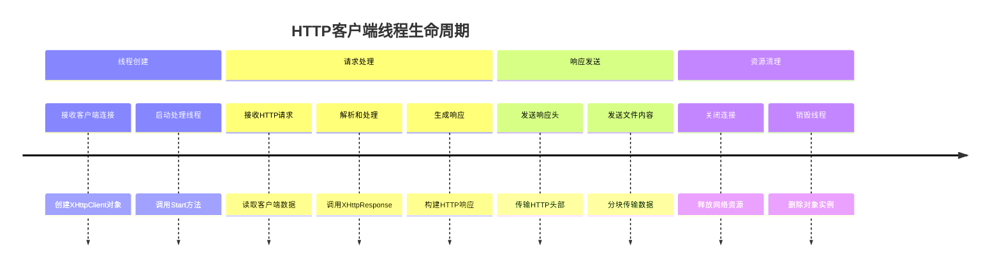

# HTTP服务器工作流程图

## 整体架构流程图

```mermaid
flowchart TD
    A[启动服务器] --> B[监听端口8080]
    B --> C{等待客户端连接}
    C -->|新连接| D[创建XHttpClient线程]
    C -->|服务器停止| Z[关闭服务器]
    
    D --> E[接收HTTP请求]
    E --> F[解析请求类型和路径]
    F --> G{请求类型判断}
    G -->|GET请求| H{文件类型判断}
    G -->|非GET请求| I[返回错误响应]
    
    H -->|PHP文件| J[调用php-cgi执行脚本]
    H -->|HTML/静态文件| K[直接读取文件]
    H -->|默认路径| L[加载index.html]
    
    J --> M[生成HTML临时文件]
    M --> N[处理PHP响应头]
    N --> O[计算文件大小]
    
    K --> O
    L --> O
    
    O --> P[生成HTTP响应头]
    P --> Q[发送响应头]
    Q --> R[发送文件内容]
    R --> S[关闭连接]
    S --> T[释放线程资源]
    T --> C
    
    I --> S
```

## 详细处理流程

### 1. 服务器启动阶段

```mermaid
sequenceDiagram
    participant M as main函数
    participant S as XHttpServer
    participant T as XTcp
    
    M->>S: Start(8080)
    S->>T: CreateSocket()
    S->>T: Bind(8080)
    S->>S: 启动主循环线程
    Note over S: 进入Main()循环
```

### 2. 请求处理阶段

```mermaid
flowchart LR
    subgraph "HTTP请求处理流程"
        A1[接收请求数据] --> A2[正则表达式解析]
        A2 --> A3[提取请求信息]
        A3 --> A4[路径处理]
        A4 --> A5[文件类型判断]
    end
    
    subgraph "PHP处理流程"
        B1[调用php-cgi] --> B2[执行PHP脚本]
        B2 --> B3[生成HTML文件]
        B3 --> B4[处理响应头]
    end
    
    subgraph "静态文件处理"
        C1[打开文件] --> C2[获取文件大小]
        C2 --> C3[读取文件内容]
    end
    
    A5 -->|PHP文件| B1
    A5 -->|静态文件| C1
    B4 --> D[生成HTTP响应]
    C3 --> D
```

### 3. 响应生成阶段

```mermaid
sequenceDiagram
    participant C as XHttpClient
    participant R as XHttpResponse
    participant T as XTcp
    participant Client as 客户端
    
    C->>R: SetRequest(request)
    R->>R: 解析GET请求
    R->>R: 处理文件路径
    R->>R: 判断文件类型
    
    alt PHP文件
        R->>R: 调用system("php-cgi")
        R->>R: 生成临时HTML文件
        R->>R: 处理PHP响应头
    else 静态文件
        R->>R: 直接打开文件
    end
    
    R->>R: 计算文件大小
    R->>C: GetHead()
    C->>T: Send(响应头)
    C->>R: Read(文件内容)
    loop 发送文件内容
        R->>C: 文件数据块
        C->>T: Send(数据块)
        T->>Client: 传输数据
    end
    C->>T: Close()
```

## 核心类交互图

```mermaid
graph TB
    subgraph "核心类结构"
        Main[main.cpp<br/>程序入口]
        HttpServer[XHttpServer<br/>服务器管理]
        HttpClient[XHttpClient<br/>客户端处理]
        HttpResponse[XHttpResponse<br/>响应生成]
        XTcp[XTcp<br/>网络通信]
    end
    
    subgraph "功能模块"
        Parser[请求解析模块]
        PHP[PHP处理模块]
        File[文件处理模块]
        Header[响应头生成]
    end
    
    Main --> HttpServer
    HttpServer --> HttpClient
    HttpClient --> HttpResponse
    HttpClient --> XTcp
    HttpResponse --> Parser
    HttpResponse --> PHP
    HttpResponse --> File
    HttpResponse --> Header
    
    Parser --> Regex[正则表达式解析]
    PHP --> System[系统调用php-cgi]
    File --> IO[文件I/O操作]
    Header --> Format[HTTP格式生成]
```

## 错误处理流程

```mermaid
flowchart TD
    A[开始处理请求] --> B{接收请求成功?}
    B -->|失败| C[关闭连接]
    B -->|成功| D{解析请求成功?}
    
    D -->|失败| E[返回400错误]
    D -->|成功| F{GET请求?}
    
    F -->|否| G[返回405错误]
    F -->|是| H{文件存在?}
    
    H -->|否| I[返回404错误]
    H -->|是| J{PHP执行成功?}
    
    J -->|失败| K[返回500错误]
    J -->|成功| L[正常处理流程]
    
    E --> M[发送错误响应]
    G --> M
    I --> M
    K --> M
    M --> C
    L --> N[发送成功响应]
    N --> C
```

## 线程生命周期

```mermaid
timeline
    title HTTP客户端线程生命周期
    section 线程创建
        接收客户端连接 : 创建XHttpClient对象
        启动处理线程 : 调用Start方法
    section 请求处理
        接收HTTP请求 : 读取客户端数据
        解析和处理 : 调用XHttpResponse
        生成响应 : 构建HTTP响应
    section 响应发送
        发送响应头 : 传输HTTP头部
        发送文件内容 : 分块传输数据
    section 资源清理
        关闭连接 : 释放网络资源
        销毁线程 : 删除对象实例
```

这个流程图完整展示了HTTP服务器从启动到处理请求的整个工作流程，包括多线程处理、请求解析、PHP脚本执行、文件传输等关键环节。